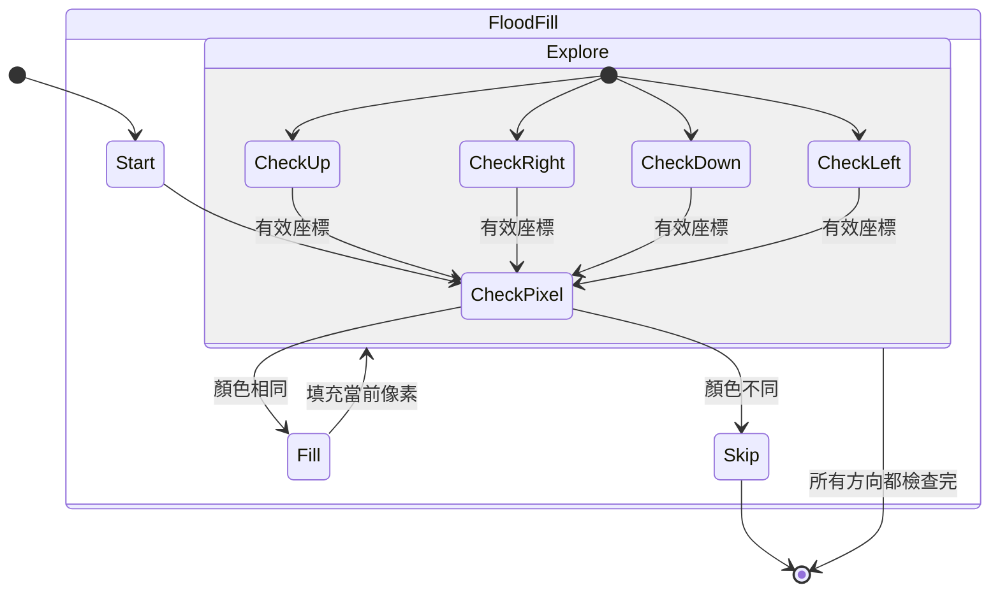

## Flood Fill

- link: https://leetcode.com/problems/flood-fill/
- topic: array, depth-first search, breadth-first search
- difficulty: easy

## 題目描述

給定一個二維整數陣列 `image` 代表一張圖片，其中每個像素都有一個整數值。同時給定起始位置的座標 `(sr, sc)` 和新的顏色值 `color`，使用類似 MS Paint 的 Flood Fill 演算法來填充圖片。

從起始像素開始，包含上下左右相連且顏色相同的像素都要被填充成新的顏色。

Example 1:

```bash
Input: 
image = [
  [1,1,1],
  [1,1,0],
  [1,0,1]
], 
sr = 1, sc = 1, color = 2

Output: [
  [2,2,2],
  [2,2,0],
  [2,0,1]
]

Explanation: 從位置 (1,1) 開始，所有與其相連且值為 1 的像素都被填充為 2
```

## 解題思路

這題是經典的 Flood Fill 演算法，就像繪圖軟體中的「油漆桶」工具：

1. **起點檢查**
   - 如果起點的顏色已經是目標顏色，直接返回
   - 記錄原始顏色，以便後續比對

2. **深度優先搜尋 (DFS)**
   - 從起點開始，檢查四個方向
   - 如果相鄰像素顏色相同，就遞迴填充
   - 每填充一個像素就改變其顏色

## 狀態機設計



## 程式碼實作

```typescript
type Image = number[][];

/**
 * 實作 Flood Fill 演算法
 * @param image - 二維陣列代表圖片
 * @param sr - 起始行座標
 * @param sc - 起始列座標
 * @param color - 新的顏色值
 * @returns 填充後的圖片
 */
const floodFill = (
    image: Image, 
    sr: number, 
    sc: number, 
    color: number
): Image => {
    // 取得圖片尺寸
    const rows = image.length;
    const cols = image[0].length;
    
    // 取得原始顏色
    const originalColor = image[sr][sc];
    
    // 如果新舊顏色相同，直接返回
    if (originalColor === color) return image;
    
    // DFS 填充函數
    const fill = (r: number, c: number): void => {
        // 檢查邊界和顏色
        if (
            r < 0 || r >= rows || 
            c < 0 || c >= cols || 
            image[r][c] !== originalColor
        ) return;
        
        // 填充當前像素
        image[r][c] = color;
        
        // 遞迴填充四個方向
        fill(r - 1, c);  // 上
        fill(r + 1, c);  // 下
        fill(r, c - 1);  // 左
        fill(r, c + 1);  // 右
    };
    
    // 開始填充
    fill(sr, sc);
    return image;
};
```

## 狀態說明

1. **Start**: 初始狀態
   - 檢查起始條件
   - 準備開始填充

2. **CheckPixel**: 檢查像素
   - 檢查座標是否有效
   - 檢查顏色是否相同

3. **Fill**: 填充狀態
   - 將當前像素改為新顏色
   - 準備探索相鄰像素

4. **Explore**: 探索狀態
   - 檢查上下左右四個方向
   - 對每個有效方向進行遞迴

## 解題心得

1. **DFS 的應用**
   - 使用遞迴實現深度優先搜尋
   - 需要注意邊界條件
   - 避免重複處理同一像素

2. **效能考量**
   - 時間複雜度：O(n)，其中 n 是圖片中的像素數量
   - 空間複雜度：O(n)，最壞情況下的遞迴深度

3. **實務應用**
   - 圖形編輯軟體的填充工具
   - 遊戲中的區域填充
   - 圖像處理中的區域標記
