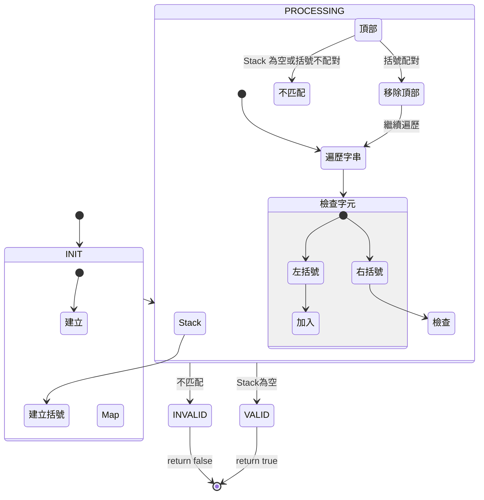

## Valid Parentheses

- link: https://leetcode.com/problems/valid-parentheses/
- topic: stack
- difficulty: easy

## 題目描述

Given a string s containing just the characters '(', ')', '{', '}', '[' and ']', determine if the input string is valid.

An input string is valid if:

1. Open brackets must be closed by the same type of brackets.
2. Open brackets must be closed in the correct order.
3. Every close bracket has a corresponding open bracket of the same type.

Example 1:

```bash
Input: s = "()"
Output: true
```

Example 2:

```bash
Input: s = "()[]{}"
Output: true
```

Example 3:

```bash
Input: s = "(]"
Output: false
```

## 限制條件

- 1 <= s.length <= 104
- s consists of parentheses only '()[]{}'

## 解題思路

這題是要判斷括號是否合法配對，也就是語法問題，去判斷括弧們有無對應的，我們可以使用 Stack（堆疊）的資料結構來解決：

1. 遇到左括號就放入堆疊
2. 遇到右括號就檢查堆疊頂部是否為對應的左括號
   - 如果是，就移除堆疊頂部的左括號
   - 如果不是，就代表括號不合法

### 複雜度分析

- 時間複雜度：O(n)，其中 n 是字串長度
- 空間複雜度：O(n)，需要一個堆疊來存儲左括號

## 解題狀態機 (XState 風格)



## 解題步驟

1. 建立一個括號對應的 `Map：'(' -> ')', '[' -> ']', '{' -> '}'`
2. 建立一個空的堆疊（stack）
3. 遍歷字串中的每個字元：
   - 如果是左括號，放入堆疊
   - 如果是右括號：
     - 如果堆疊為空或頂部的左括號不匹配，返回 false
     - 如果匹配，移除堆疊頂部的左括號
4. 最後檢查堆疊是否為空（確保所有左括號都有對應的右括號）

## 實作

```javascript
const isValid = (s) => {
    const stack = [];
    const bracketMap = {
        '(': ')',
        '[': ']',
        '{': '}'
    };
    
    for (const char of s) {
        if (bracketMap[char]) {
            // 左括號
            stack.push(char);
        } else {
            // 右括號
            const lastBracket = stack.pop();
            if (bracketMap[lastBracket] !== char) {
                return false;
            }
        }
    }
    
    return stack.length === 0;
};
```

## 解題心得

這題是典型的堆疊（Stack）應用題，透過 LIFO（Last In First Out）的特性來處理括號的配對問題。解題時要特別注意：

1. 右括號出現時，堆疊必須不為空
2. 最後要檢查堆疊是否清空（確保沒有未配對的左括號）
3. 使用 Map 來儲存括號對應關係，可以讓程式碼更簡潔易讀

這個解法不只適用於括號配對，也可以應用在其他需要配對檢查的場景，如 HTML 標籤的配對檢查（過去在 debug 時，遇到太多次這個問題，所以對這題特別熟練XD）
