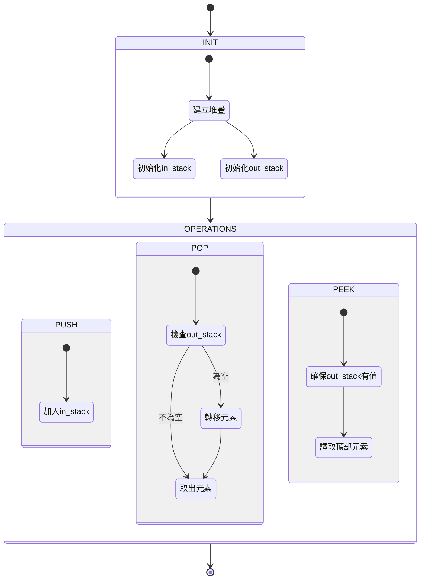

## Implement Queue using Stacks

- link: https://leetcode.com/problems/implement-queue-using-stacks/
- topic: stack, design
- difficulty: easy

## 題目描述

使用兩個堆疊（Stack）來實現先進先出（FIFO）隊列（Queue）。

### 範例

```bash
MyQueue queue = new MyQueue();
queue.push(1);          // queue is: [1]
queue.push(2);          // queue is: [1, 2]
queue.peek();           // return 1
queue.pop();            // return 1, queue is: [2]
queue.empty();          // return false
```

### 限制條件

- `1 <= x <= 9`
- 最多呼叫 100 次 `push`、`pop`、`peek` 和 `empty`
- 所有 `pop` 和 `peek` 的呼叫都是有效的

## 解題思路

這題的核心概念是使用兩個堆疊來模擬隊列的行為：



### 運作原理

1. **初始狀態**：

```bash
in:  [3, 2, 1]   out: []
```

2. **當需要 pop/peek 時**：

```bash
in:  []          out: [1, 2, 3]
```

3. **pop 操作後**：

```bash
in:  []          out: [1, 2]    // 返回 3
```

### 複雜度分析

- **push**: O(1)
- **pop**: 平攤 O(1)
- **peek**: 平攤 O(1)
- **empty**: O(1)

## 程式碼實作

```typescript
type Queue = {
  push: (x: number) => void;
  pop: () => number;
  peek: () => number;
  empty: () => boolean;
};

export const createQueue = (): Queue => {
  // 使用兩個堆疊來實現 FIFO 隊列
  const stacks = {
    in: [] as number[],   // 用於新增元素
    out: [] as number[]   // 用於取出元素
  };

  // 確保 out stack 有元素可用
  const transfer = () => {
    const { in: inStack, out: outStack } = stacks;
    
    if (!outStack.length && inStack.length) {
      outStack.push(...inStack.reverse());
      inStack.length = 0;
    }
  };

  return {
    // 新增元素到 in stack
    push: (x: number) => void stacks.in.push(x),

    // 從 out stack 取出元素
    pop: () => {
      transfer();
      return stacks.out.pop()!;
    },

    // 查看 out stack 最上面的元素
    peek: () => {
      transfer();
      return stacks.out.at(-1)!;
    },

    // 檢查兩個 stack 是否都為空
    empty: () => !stacks.in.length && !stacks.out.length
  };
};
```

## 程式碼說明

1. **語法特性**：
   - 使用 `at(-1)` 取代 `length - 1`，因為 `at` 是 O(1) 的時間複雜度，而 `length - 1` 是 O(n) 的時間複雜度

2. **效能優化**：

   ```typescript
   // 只在需要時才移動元素
   if (!outStack.length && inStack.length) {
     transfer();
   }
   ```

## 解題心得

1. **實務應用**
   - 在前端開發中常見的場景
   - 例如：任務佇列、事件處理等
