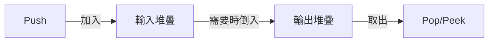

## Implement Queue using Stacks

- link: https://leetcode.com/problems/implement-queue-using-stacks/
- topic: stack, design
- difficulty: easy

## 題目描述

使用兩個堆疊（Stack）來實現先進先出（FIFO）佇列（Queue）。

### 範例

```bash
MyQueue queue = new MyQueue();
queue.push(1);          // queue is: [1]
queue.push(2);          // queue is: [1, 2]
queue.peek();           // return 1
queue.pop();            // return 1, queue is: [2]
queue.empty();          // return false
```

### 限制條件

- `1 <= x <= 9`
- 最多呼叫 100 次 `push`、`pop`、`peek` 和 `empty`
- 所有 `pop` 和 `peek` 的呼叫都是有效的

## 解題思路

這題的核心概念是使用兩個堆疊來模擬佇列的行為：



## 程式碼實作

```typescript
type Queue<T> = {
  push: (x: T) => void;
  pop: () => T;
  peek: () => T;
  empty: () => boolean;
};

const createQueue = <T>(): Queue<T> => {
  // 使用兩個堆疊來實現 FIFO 佇列
  const stacks = {
    in: [] as T[],   // 用於新增元素
    out: [] as T[]   // 用於取出元素
  };

  // 當輸出堆疊為空時，將輸入堆疊的元素轉移到輸出堆疊
  // 這樣可以維持先進先出（FIFO）的順序
  const transfer = () => {
    // 只有當輸出堆疊為空，且輸入堆疊有元素時才需要轉移
    if (!stacks.out.length && stacks.in.length) {
      // 將輸入堆疊的所有元素反轉後放入輸出堆疊
      // 反轉是為了保持原始的插入順序
      stacks.out.push(...stacks.in.reverse());
      
      // 清空輸入堆疊，避免重複轉移
      stacks.in.length = 0;
    }
  };

  return {
    // 新增元素到輸入堆疊
    push: (x: T) => void stacks.in.push(x),

    // 從輸出堆疊取出元素
    pop: () => {
      transfer();
      return stacks.out.pop()!;
    },

    // 查看輸出堆疊最上面的元素
    peek: () => {
      transfer();
      return stacks.out.at(-1)!;
    },

    // 檢查兩個堆疊是否都為空
    empty: () => !stacks.in.length && !stacks.out.length
  };
};

// 使用範例
const queue = createQueue<number>();
queue.push(1);
queue.push(2);
console.log(queue.peek());  // 1
console.log(queue.pop());   // 1
console.log(queue.empty()); // false
```

## 複雜度分析

- **時間複雜度**
  - push: O(1)
  - pop: 平攤 O(1)
  - peek: 平攤 O(1)
  - empty: O(1)

- **空間複雜度**: O(n)，n 為佇列中的元素數量

## 解題心得

1. **堆疊與佇列的轉換**
   - 使用 transfer 函式來確保輸出堆疊有元素可用
   - 這樣可以維持先進先出（FIFO）的順序
   - 反轉輸入堆疊是為了保持原始的插入順序

2. **程式碼管理**
   - 使用閉包保護內部狀態
