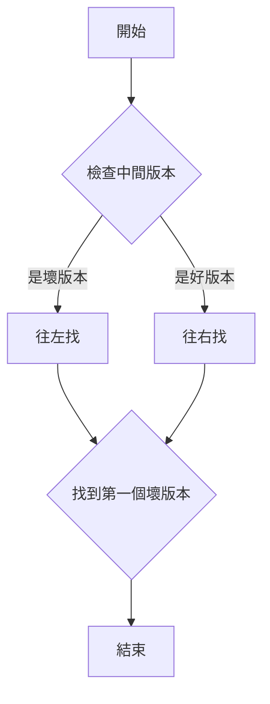

## First Bad Version

- link: https://leetcode.com/problems/first-bad-version/
- topic: binary search
- difficulty: easy

## 題目描述

You are a product manager and currently leading a team to develop a new product. Unfortunately, the
latest version of your product fails the quality check. Since each version is developed based on the
previous version, all the versions after a bad version are also bad.

Suppose you have n versions ［1, 2， •..n］ and you want to find out the first bad one, which causes all
the following ones to be bad.

You are given an APl bool isBadVersion（version） which returns whether version is bad. Implement a
function to find the first bad version. You should minimize the number of calls to the API.

簡單理解：實作一個函數，找出第一個出錯的故障版本

### 範例

```bash
Input: n = 5, bad = 4
Output: 4
Explanation:
呼叫 isBadVersion(3) -> false
呼叫 isBadVersion(5) -> true
呼叫 isBadVersion(4) -> true
所以第一個壞版本是 4
```

### 限制條件

- `1 <= bad <= n <= 2^31 - 1`
- `isBadVersion` API 呼叫次數越少越好

## 解題思路

這題的核心概念是使用二分搜尋來最小化 API 呼叫次數：



## 程式碼實作

```typescript
type FirstBadVersionFn = (n: number) => number;

export const solution = (isBadVersion: (version: number) => boolean): FirstBadVersionFn => {
    // 使用遞迴來實現二分搜尋
    const binarySearch = ({ left, right }: { left: number; right: number }): number => {
        // 基本情況：找到第一個壞版本
        if (left === right) return left;

        // 避免整數溢出的寫法
        const mid = left + Math.floor((right - left) / 2);
        
        return isBadVersion(mid)
            // 如果是壞版本，第一個壞版本可能是這個或在左邊
            ? binarySearch({ left, right: mid })
            // 如果是好版本，第一個壞版本一定在右邊
            : binarySearch({ left: mid + 1, right });
    };

    return (n: number): number => binarySearch({ left: 1, right: n });
};
```

## 程式碼說明

1. **二分搜尋的重點**：

    在尋找中間點時，我們需要特別注意計算方式：

    ```typescript
    // 找中間點的兩種寫法：
    
    // 寫法一：直接相加除二
    const mid = Math.floor((left + right) / 2);
    
    // 寫法二：計算距離的一半
    const mid = left + Math.floor((right - left) / 2);
    
    // 兩種寫法結果相同，但第二種寫法更安全
    // 因為即使 left 和 right 很大，right - left 的結果不會太大
    ```

## 複雜度分析

- **時間複雜度**: O(log n)
  - 使用二分搜尋，每次將搜尋範圍減半
  - n 是版本總數

- **空間複雜度**: O(log n)
  - 使用遞迴，堆疊深度為 log n
  - 如果使用迴圈則為 O(1)

## 解題心得

1. **二分搜尋的應用**
   - 當資料有序且需要找到特定條件的第一個元素時
   - 可以大幅減少搜尋次數

2. **程式碼優化**
   - 使用遞迴可以讓程式碼更簡潔易讀
   - 但要注意堆疊溢出的風險

3. **實務應用**

   ```typescript
   // 在實務上的應用場景
   const findFirstBugCommit = async (commits: string[]) => {
       const isBuggy = async (commit: string) => {
           const result = await runTests(commit);
           return !result.success;
       };

       const firstBad = solution(isBuggy);
       return commits[firstBad(commits.length) - 1];
   };
   ```
