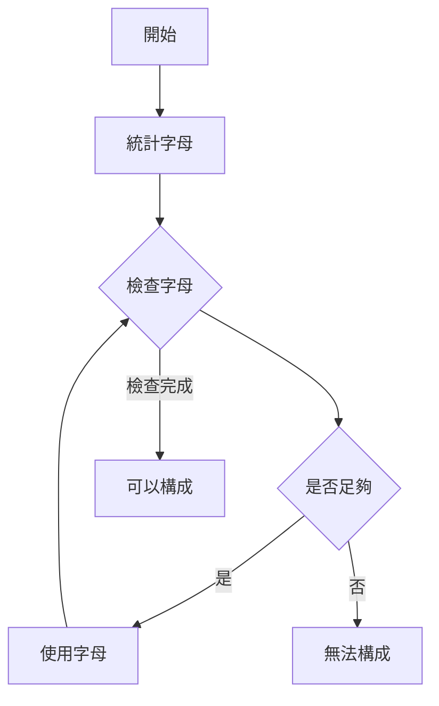

## Ransom Note

- link: https://leetcode.com/problems/ransom-note/
- topic: hash table, string, counting
- difficulty: easy

## 題目描述

給定兩個字串 `ransomNote` 和 `magazine`，判斷 `ransomNote` 是否可以由 `magazine` 中的字母組成

PS：每個字母只能使用一次

### 範例

```bash
Example 1:
Input: 
    ransomNote = "a"
    magazine = "b"
Output: false
解釋：magazine 中沒有字母 'a'

Example 2:
Input:
    ransomNote = "aa"
    magazine = "ab"
Output: false
解釋：magazine 只有一個 'a'，但需要兩個

Example 3:
Input:
    ransomNote = "aa"
    magazine = "aab"
Output: true
解釋：magazine 有兩個 'a'，足夠使用
```

### 限制條件

- `1 <= ransomNote.length, magazine.length <= 10^5`
- `ransomNote` 和 `magazine` 只包含小寫英文字母

## 解題思路

解題步驟很直觀：

1. 先統計 magazine 中每個字母的數量
2. 檢查 ransomNote 中的每個字母，每使用一個就從計數中減去一個
3. 如果某個字母的數量不足，就表示無法構成



## 程式碼實作

```typescript
export const canConstruct = (ransomNote: string, magazine: string): boolean => {
    // 如果 ransomNote 比 magazine 長，一定不夠用
    if (ransomNote.length > magazine.length) return false;

    // 使用 Map 來記錄每個字母的數量
    const letterMap = new Map<string, number>();
    
    // 統計 magazine 中每個字母的數量
    for (const char of magazine) {
        letterMap.set(char, (letterMap.get(char) || 0) + 1);
    }

    // 檢查 ransomNote 中的每個字母
    for (const char of ransomNote) {
        const count = letterMap.get(char) || 0;
        
        // 如果字母不夠用了
        if (count === 0) return false;
        
        // 使用一個字母
        letterMap.set(char, count - 1);
    }

    return true;
};
```

## 複雜度分析

- **時間複雜度**: O(m + n)
  - m 是 magazine 的長度
  - n 是 ransomNote 的長度
  - 需要遍歷兩個字串各一次

- **空間複雜度**: O(1)
  - 雖然使用了 Map
  - 但因為只有 26 個小寫字母
  - 所以空間是常數

## 解題心得

1. **資料結構的選擇**
    - 使用 new Map() 來建立 Map 物件，並且 Map 預設就可以避免全域污染
    - 也有 get/set 方法，可以方便的存數值和修改
