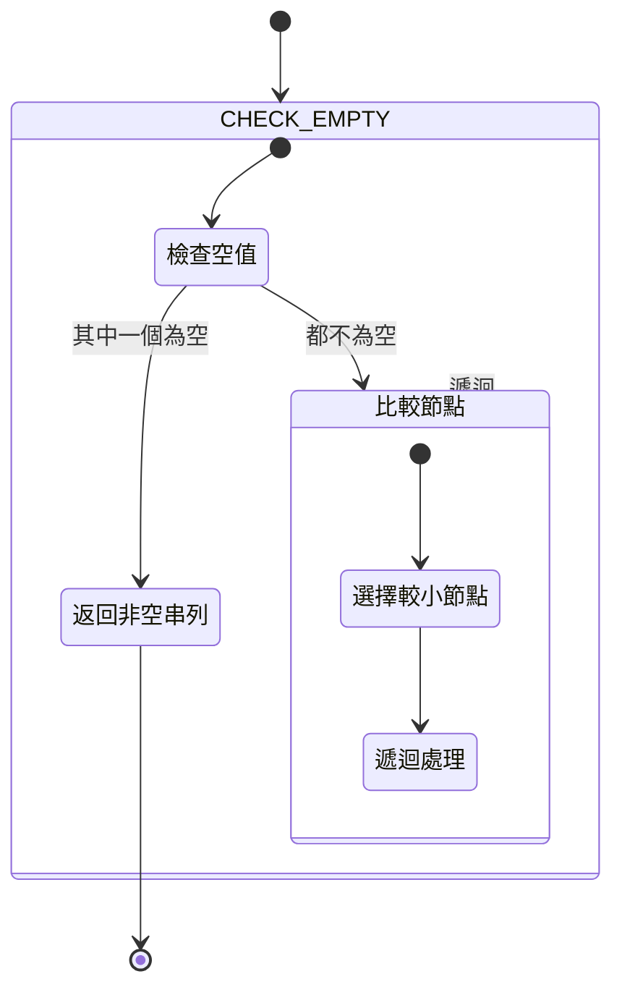

## Merge Two Sorted Lists

- link: https://leetcode.com/problems/merge-two-sorted-lists/
- topic: linked list
- difficulty: easy

## 題目描述

You are given the heads of two sorted linked lists `list1` and `list2`.

Merge the two lists in a one sorted list. The list should be made by splicing together the nodes of the first two lists.

Return the head of the merged linked list.

Example 1:

```bash
Input: list1 = [1,2,4], list2 = [1,3,4]
Output: [1,1,2,3,4,4]
```

Example 2:

```bash
Input: list1 = [], list2 = []
Output: []
```

Example 3:

```bash
Input: list1 = [], list2 = [0]
Output: [0]
```

## 限制條件

- The number of nodes in both lists is in the range `[0, 50]`
- `-100 <= Node.val <= 100`
- Both `list1` and `list2` are sorted in non-decreasing order

## 解題思路

這題是要合併兩個已排序的鏈結串列，主要的思路是：

1. 處理邊界情況：當其中一個串列為空時，直接返回另一個串列
2. 比較兩個串列當前節點的值，選擇較小的節點
3. 遞迴處理剩餘的節點
4. 返回合併後的串列

### 複雜度分析

- 時間複雜度：O(n + m)，其中 n 和 m 分別是兩個串列的長度
- 空間複雜度：O(n)，遞迴調用會使用堆疊空間

## 解題狀態機 (XState 風格)



## 解題步驟

1. 檢查是否有空串列，如果有則返回非空的串列
2. 比較兩個串列當前節點的值
3. 選擇較小的節點，並遞迴處理剩餘節點
4. 返回合併後的結果

## 實作

```javascript
const mergeTwoLists = (list1, list2) => {
  // 使用 ?? 運算子處理空值情況
  if (!list1 || !list2) return list1 ?? list2

  const [smaller, bigger] = list1.val <= list2.val ? [list1, list2] : [list2, list1]
  smaller.next = mergeTwoLists(smaller.next, bigger)
  return smaller
}
```

## 解題心得

在解這道合併排序鏈結串列的題目時，我有幾個重要的發現和優化：

1. **解構賦值的運用**

   - 使用 `const [smaller, bigger] = ...` 的解構賦值
   - 讓程式碼更具可讀性
   - 避免了多餘的暫存變數

2. **邊界條件的處理**
   - 特別注意處理了空串列的情況
   - 當其中一個串列為空時，直接返回另一個串列

透過遞迴的方式，我們可以用最少的程式碼完成這個看似複雜的任務，搭配解構賦值和空值合併運算子，讓程式碼更簡潔。
