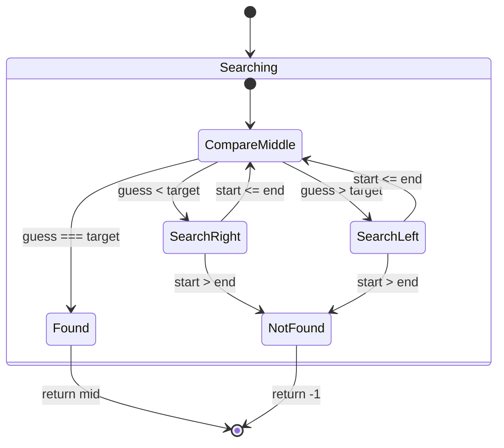

## Binary Search

- link: https://leetcode.com/problems/binary-search/
- topic: array, binary search
- difficulty: easy

## 題目描述

給定一個已排序的整數陣列 nums 和一個目標值 target，如果目標值存在於陣列中則返回其索引，否則返回 -1。

Example 1:
```bash
Input: nums = [-1,0,3,5,9,12], target = 9
Output: 4
Explanation: 9 出現在索引 4 的位置
```

Example 2:
```bash
Input: nums = [-1,0,3,5,9,12], target = 2
Output: -1
Explanation: 2 不存在於陣列中
```

## 解題思路

這題使用二分搜尋法，步驟如下：

1. **初始設定**
   ```javascript
   nums = [-1, 0, 3, 5, 9, 12]
   target = 9
   
   left = 0, right = 5  // 初始指針
   mid = 2              // (0 + 5) / 2 = 2
   ```

2. **搜尋過程**
   ```javascript
   // 第一次比較
   nums[mid] = 3 < target(9)
   left = mid + 1 = 3
   
   // 第二次比較
   mid = 4              // (3 + 5) / 2 = 4
   nums[mid] = 9 === target(9)
   return mid           // 找到目標值
   ```

### 複雜度分析
- 時間複雜度：O(log n)，每次比較都會將搜尋範圍減半
- 空間複雜度：O(1)，只使用常數額外空間

## 狀態機設計



## 程式碼實作

```javascript
const search = (nums, target) => {
    // 定義搜尋範圍，start 是左邊界，end 是右邊界
    let [start, end] = [0, nums.length - 1];
    
    // 當還有範圍可搜尋時
    while (start <= end) {
        // State: CompareMiddle 切一半
        const mid = Math.floor((start + end) / 2);
        const guess = nums[mid];
        
        // State: Found
        if (guess === target) return mid;
        
        // State: SearchRight or SearchLeft
        [start, end] = guess < target 
            ? [mid + 1, end]    // SearchRight
            : [start, mid - 1]; // SearchLeft
    }
    
    // State: NotFound
    return -1;
};
```

## 狀態說明

1. **Searching**: 主要搜尋狀態
   - 包含整個搜尋過程
   - 控制搜尋的流程和轉換

2. **CompareMiddle**: 比較中間值
   - 計算中間位置
   - 比較目標值和中間值
   - 決定下一步行動

3. **SearchRight**: 往右搜尋
   - 當目標值大於中間值
   - 更新搜尋範圍到右半部

4. **SearchLeft**: 往左搜尋
   - 當目標值小於中間值
   - 更新搜尋範圍到左半部

5. **Found**: 找到目標
   - 當中間值等於目標值
   - 返回當前索引

6. **NotFound**: 未找到目標
   - 當搜尋範圍耗盡
   - 返回 -1

## 解題心得

1. **二分搜尋的關鍵**
   - 陣列必須是已排序的
   - 正確處理邊界條件很重要
   - 注意中間值的計算方式

2. **實務應用**
   - 二分搜尋在大型資料集中特別有用
   - 可以提升搜尋效率
   - 常用在資料庫索引情境內
