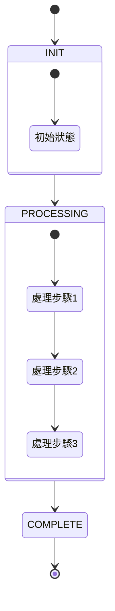

## 題目資訊

- 連結：[LeetCode 題目連結]
- 主題：[相關主題，如：array, string, dynamic programming 等]
- 難度：[Easy/Medium/Hard]

## 題目描述

[在此貼上英文題目描述]

### 範例

Example 1:

```javascript
Input:
Output:
Explanation:
```

Example 2:

```javascript
Input:
Output:
Explanation:
```

### 限制條件

- [限制條件 1]
- [限制條件 2]
- [限制條件 3]

## 解題思路

[說明你的解題思路和策略]

### 複雜度分析

- 時間複雜度：O(?)
- 空間複雜度：O(?)

## 解題狀態機 (XState 風格)



## 狀態說明

1. **INIT**: 初始化狀態

   - [說明初始化做了什麼]

2. **PROCESSING**: 主要處理邏輯

   - [說明處理步驟]

3. **COMPLETE**: 完成狀態
   - [說明最終結果]

## 解題步驟

1. 第一步
   - [詳細說明]
2. 第二步
   - [詳細說明]
3. 第三步
   - [詳細說明]

## 實作

```javascript
// 在此貼上你的程式碼實作
// 記得加上適當的註解
```

## 解題心得

[分享你的解題心得，可以包含：

- 你遇到的困難
- 學到的新知識
- 可能的優化方向
- 其他解法的比較等等

]
